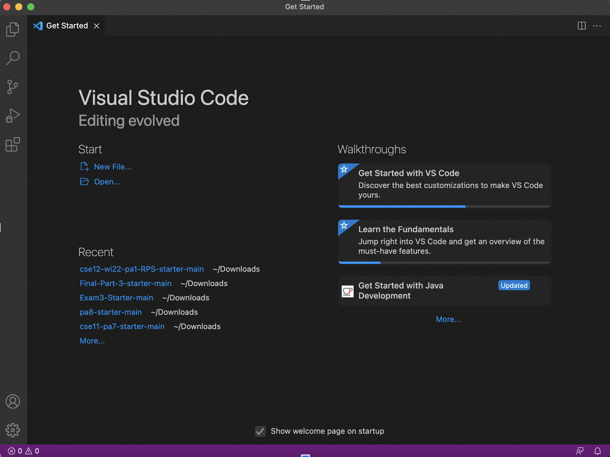
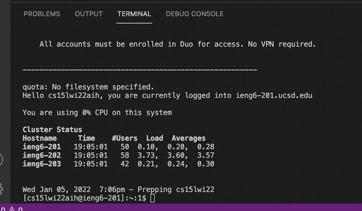
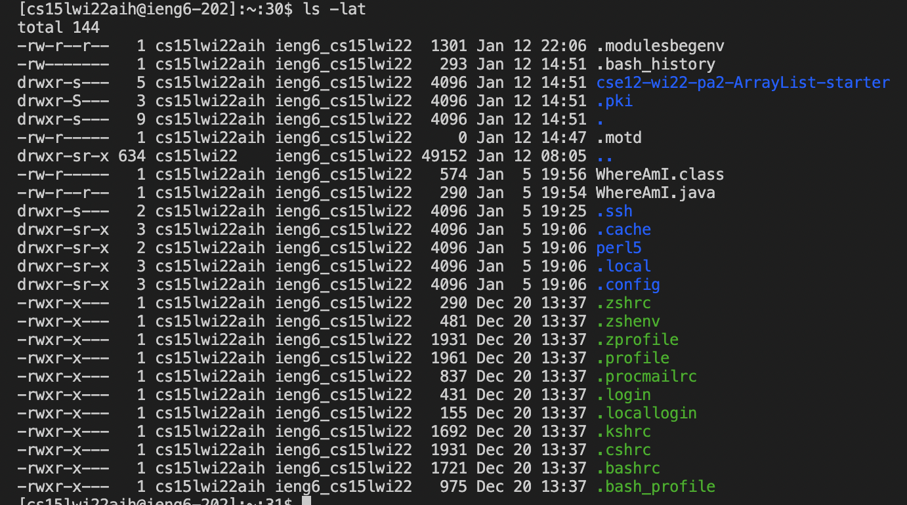
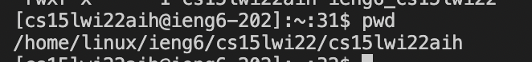
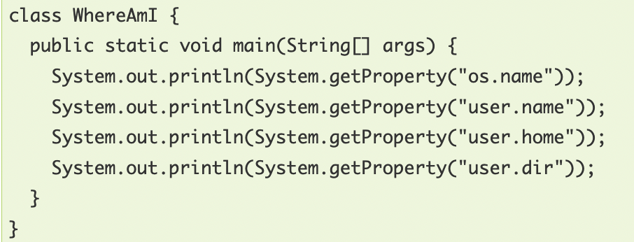
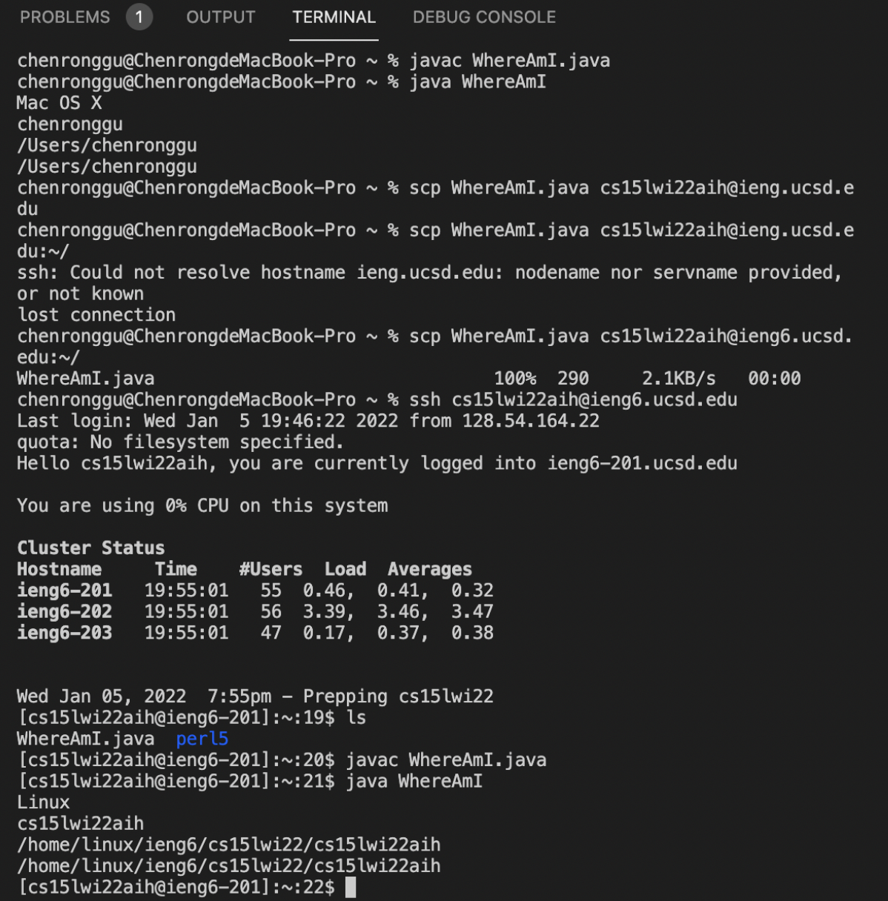
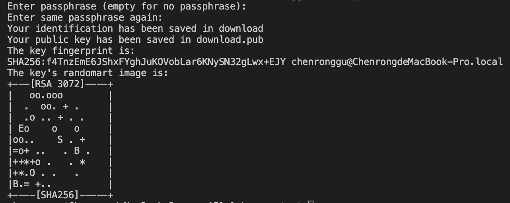
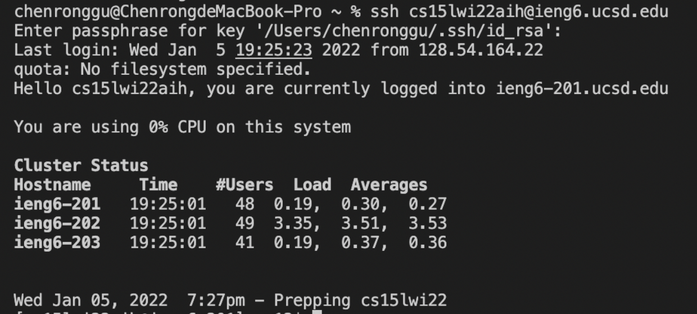
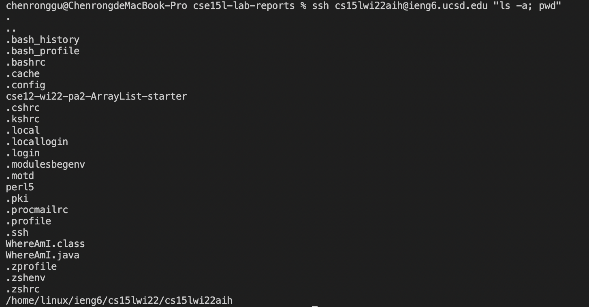

# Report 1 of Chenong Gu
> ## Installing VScode

First of all, we need to download Visual Studio Code software, which can be found on [link](https://code.visualstudio.com/). After installing the right version depended by the operating system of our computer, we cna open it (My version is MACOS). This is what we should see when we open VScode. 

 


> ## Remotely Connecting

Then we can try to connect the server, which is a remote computer (Due to that I use MACOS, I do not need to install OpenSSH). 
After opening VScode, we need to open a new terminal. This is where we can type our command to connect the server.

`$ ssh cs15lwi22aih@ieng6.ucsd.edu`

After typing the command above and finishing entering password, I can now access the remote server (everyone has different course-specfic account). 

During the process we may need to follow the instruction to show that we do want to connect.
The message that shows you successfully connected looks like this:



> ## Trying Some Commands

It's interesting and necessary to try some commands on both the server and our own computer to compare. 

Here is the result after I entered  *`la -lat`* command:



We can see some specfic details of directories, including the name, the last access time, and user id of the directories. 

When we run *`pwd`* command, we will see the current working directory we are in.



> ## Moving Files with *`scp`*

If we want to move the files on our own computer to the server, we need to use *`scp`* command. 

In this case, I used a file called WhereAmI.java.



This file is stored in my computer, but can be moved to the server by using this command:

*`scp WhereAmI.java cs15lwi22aih@ieng6.ucsd.edu:~/`*

Here is the results I ran this code before and after I moved it to the server. 



Running this code on the server can result to show the operating system of the server.

> ## Setting an SSH Key

We may feel inconvenient for entering password everytime we want to connect to the server. We can use ssh keys to store our password in our computer, and save the time for entering password.

We may use *`ssh-keygen`* to achieve that:


Then we type in the address we want to store the key.



Here I should save my key to *`/Users/chenronggu/.ssh/id_rsa`*, but due to that I have originally saved it once, I show the process with "download" address.

Then I typed commands below (with instruction):

```
$ ssh cs15lwi22aih@ieng6.ucsd.edu
<Enter Password>
# now on server
$ mkdir .ssh
$ <logout>
# back on client
$ scp /Users/chenronggu/.ssh/id_rsa.pub cs15lwi22aih@ieng6.ucsd.edu:~/.ssh/authorized_keys
# You use your username and the path you saw in the command above
```

As a result of all process above, we could connect to the server without entering password:



> ## Optimizing Remote Running

During the process that we run command on the server, we jave some skills to make things easier. For example, we can simply use *`""`* and *`;`* to type two commands together with *`ssh`* connection command.



*`;`* can be used to implement multiple commands together.

Other skills like using multiple terminals to avoid exiting server and taking notes of common-used commands are quite useful. 
