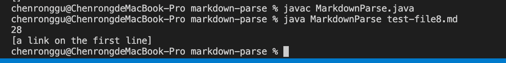

# Report 2 of Chenong Gu
> ## Code Change 1

Failure-inducing input: [noLinkFile.md](https://github.com/Emrys025/markdown-parse/blob/main/noLinkFile.md)

Symptom of this failure-inducing input: 

When the input file contains no valid or complete link with correct brackets and parentheses consequence, the program will throw a StringIndexOutOfBoundsException. This is because if "indexOf" method can not find bracket or parentheses at correct position, it will return -1, which is less than 0 and out of the lower bound of string index. 

So if we want to call another "indexOf" method with -1 index, an exception will be thrown. 

Our change added an if statement to exclude this situation.

> ## Code Change 2

Failure-inducing input: [imageTest.md](https://github.com/Emrys025/markdown-parse/blob/main/imageTest.md) and [extraCloses.md](https://github.com/Emrys025/markdown-parse/blob/main/extraCloses.md)

Symptom of this failure-inducing input:

When the input file contains markdown images (with "!" in front of the open bracket), the program will not recognize the "!" symbol, and continues to print the link to the image, which is not what we are supposed to do. Also, when there exists some characters between the end bracket and the open parentheses, the link is invalid in markdown file but the program will still print the invalid link.

Our change added an if statement to exclude these situations.

> ## Code Change 3

Failure-inducing input: [test-file8.md](https://github.com/Emrys025/markdown-parse/blob/main/test-file8.md)

Symptom of this failure-inducing input:

When the input file contains a non-link sentence in the link's position, the program will recognize whether or not the thing stored between two parentheses is a valid link. So, when inputing the failure-inducing file, the program print out a non-link sentence, which is not what we want.

Our change added an if statement to check whether the sentence stored between two parentheses have spaces (a vaild link will not have spaces). So that we can judge if we have a vaild link or not.

