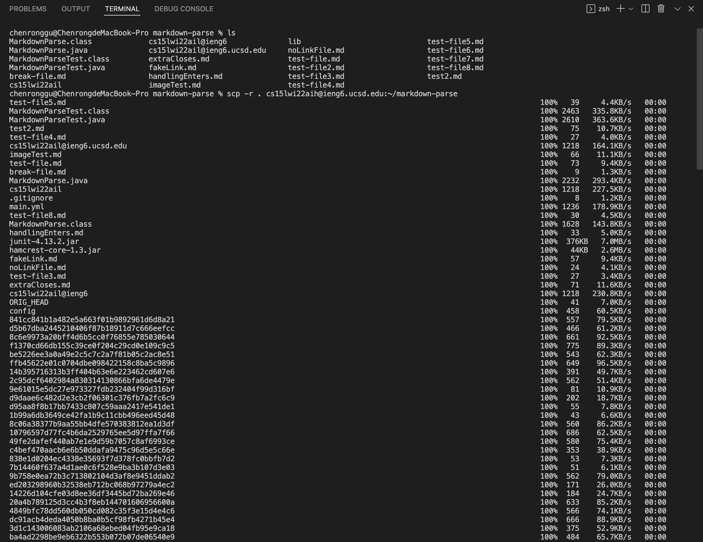
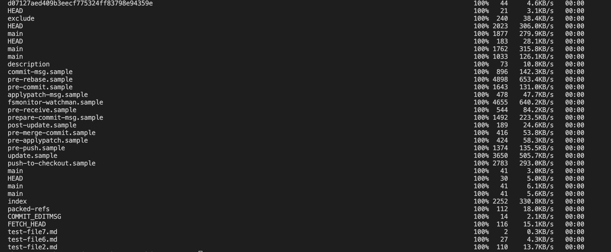
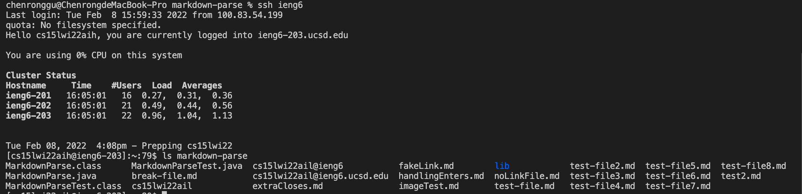
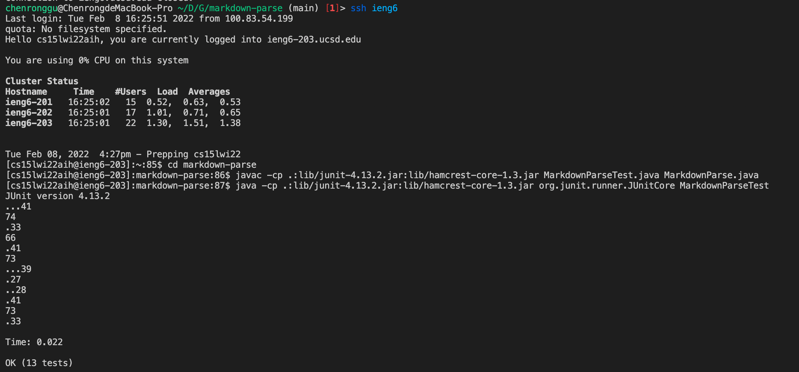
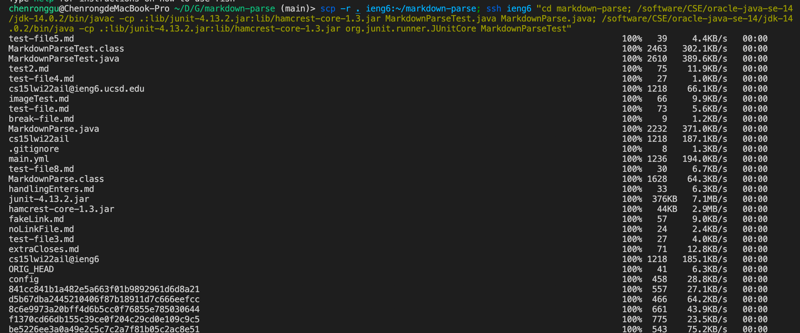
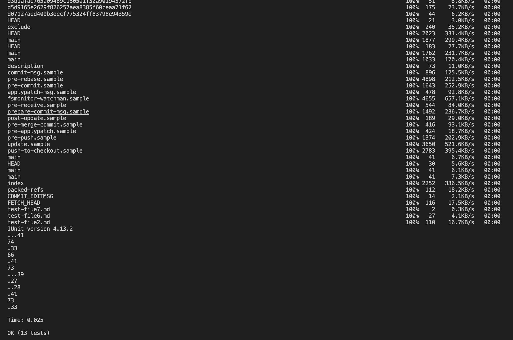

# Report 3 of Chenrong Gu
# *Group choice 3*
> ## Copying the markdown-parse directory to my ieng6 account

First of all, I opened a terminal inside the repo. We can also use *`cd`* command to do it.

Using *`ls`* command, we can know the there are 23 files/folders in the repo. Then I used *`scp -r`* command to copy the entire repo to the server. 

After all the transmission process, I logged into ieng6 server. using *`ls`* caommand, we can find that now in the *markdown-parse* repo on the server, we have all the 23 files/folders.

Also, this command copies all the files both we can see using *`ls`* command and the hidden files in *`.git`*. If we want to only copy files ending with ".java", ".md" and the libs, we can use the command *`scp -r *.java *.md lib/ ieng6:markdown-parse`*.

> ## Compiling and running the tests for the repository on the server

After copying the repo to the server, I logged into the server. On the server, I used the command to compile *MarkdownParseTest.java* and *MarkdownParse.java* and run the test file. 

As expected, they all succeeded and all the tests passed.

> ## Copying the whole directory and run the tests in one line

In order to make programming more efficient and elegant, we can use one line of command to do all the things above.

In this case, I used semicolon to seperate the *`scp`* command and *`ssh`* command. Then, after using *`ssh`* command, I seperated *`cd`* command and *`javac`* and *`java`* commands within the quotation marks also with semicolons.

In order to make *`ssh`* command use a right path when being called together with other commands, I used Professor Politz's workaround, just as below. 

