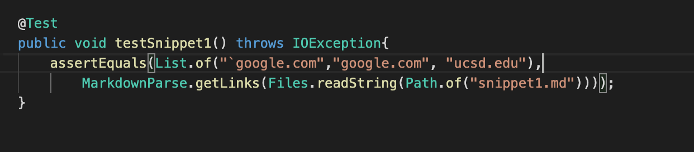
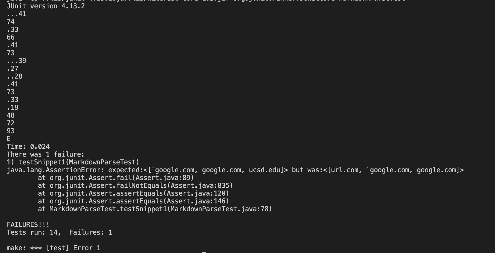
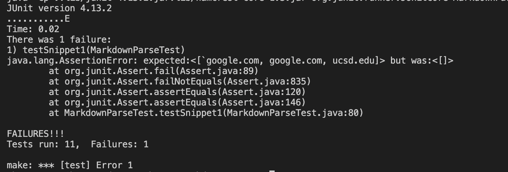
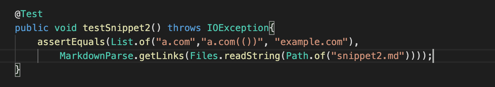
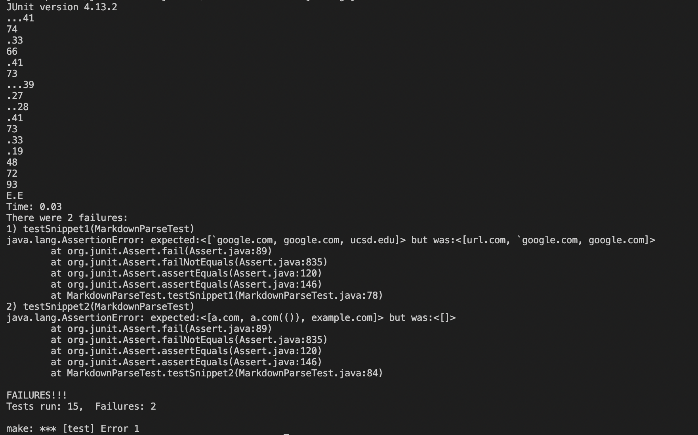
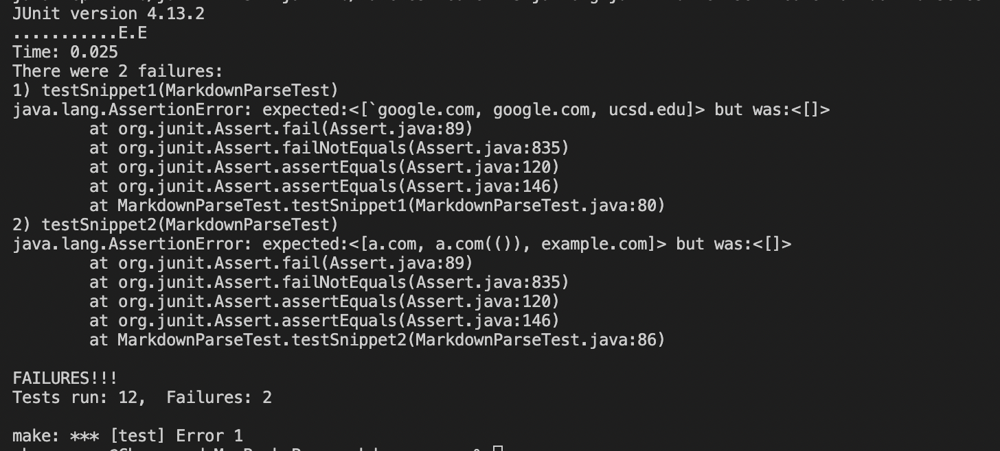
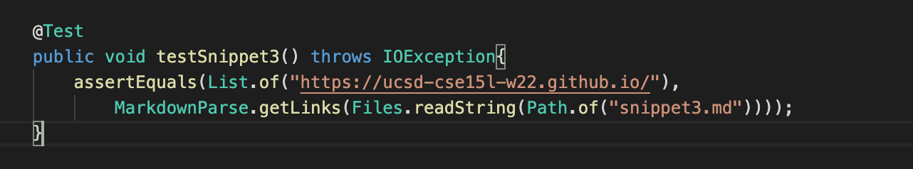
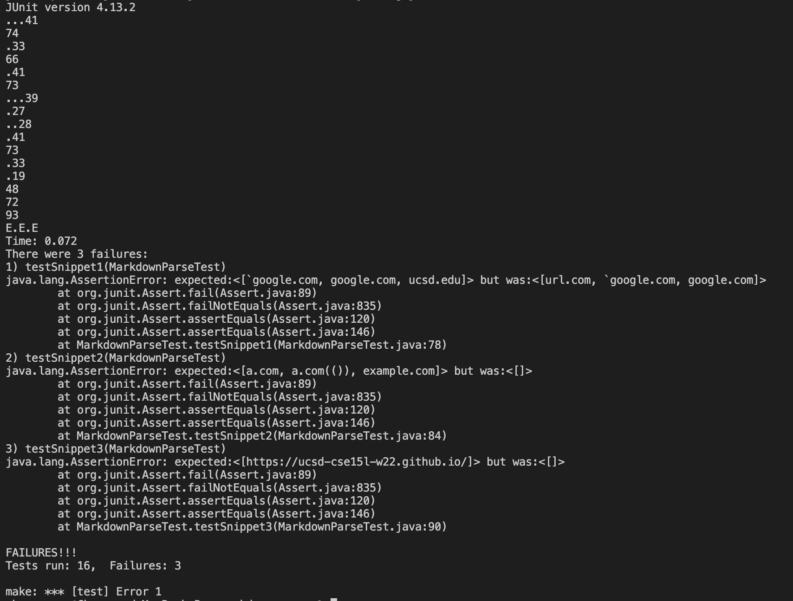
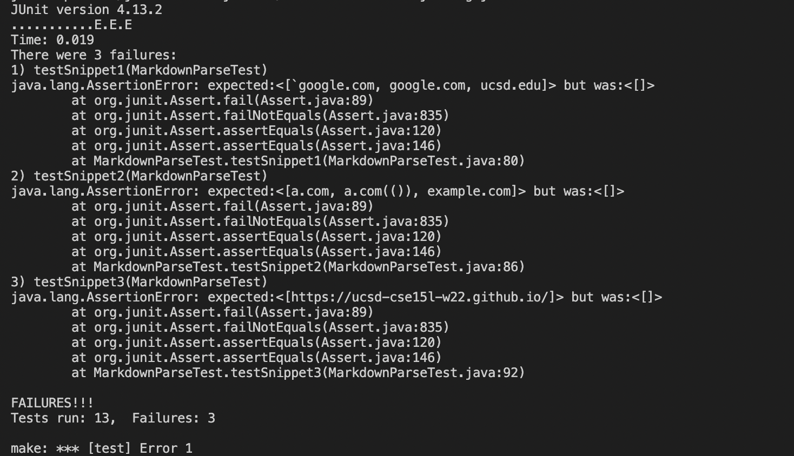

# Report 4 of Chenong Gu

[My markdown-parse repository](https://github.com/Emrys025/markdown-parse)

[The markdown-parse I reviewed](https://github.com/BasilThaddeus/markdown-parse)

> ## Snippet 1

> The predicted output

[`google.com, google.com, ucsd.edu]

> The test of snippet 1

> For my implementation

The test failed

> For the implementation I reviewed

The test failed

> ## Snippet 2

> The predicted output

[a.com, a.com(()), example.com]

> The test of snippet 2

> For my implementation

The test failed

> For the implementation I reviewed

The test failed

> ## Snippet 3

> The predicted output

[https://ucsd-cse15l-w22.github.io/]

> The test of snippet3

> For my implementation

The test failed

> For the implementation I reviewed

The test failed

> ## Debuging

> For Snippet 1

For my implementation, I think it's possible to use a small code change to make it work for cases having inline code with backticks. In order to do that, we need to check whether *`[`*, *`]`*, *`(`*, *`)`* are between two paired backticks. In the other word, we need to check if we have paired brackets and parenthesis outside paired backticks. 

To achieve that, we need to judge if there's paired backticks when looking for the index of the next bracket or parenthesis. We can compare their index, which I think is less than 10-lines code.

> For Snippet 2

For my implementation, I think it's also not possible to use a small code change to make it work for cases having nested parenthesis, brackets, and escaped brackets. 

It's hard to identify nested brackets and parenthesis, which has many different situations. Like the first line in snippet 2, there's a valid link inside a pair of brackets. The work need to do is more involved than 10 lines.

> For Snippet 3

For my implementation, I think it's not possible to use a small code change to make it work for cases having new lines in brackets and parenthesis. 

What we need to do is to identify line breaks and than judge some more situations. For example, if we only have one line break, we should print the content. but we sohuld not print the content if we have an entire enpty line. The work need to do is much more than 10 lines.