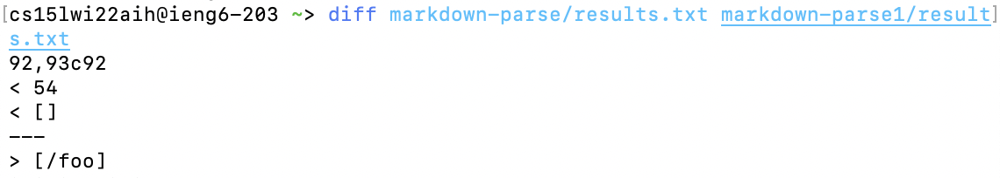
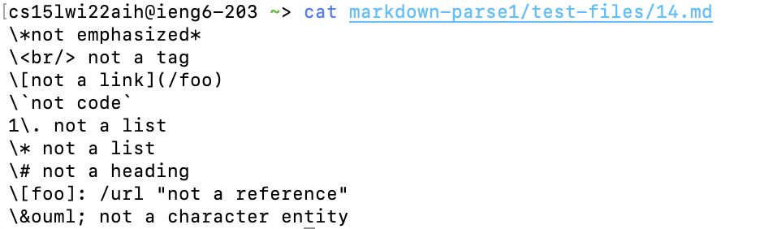
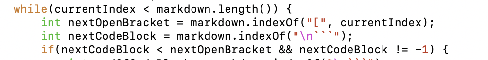
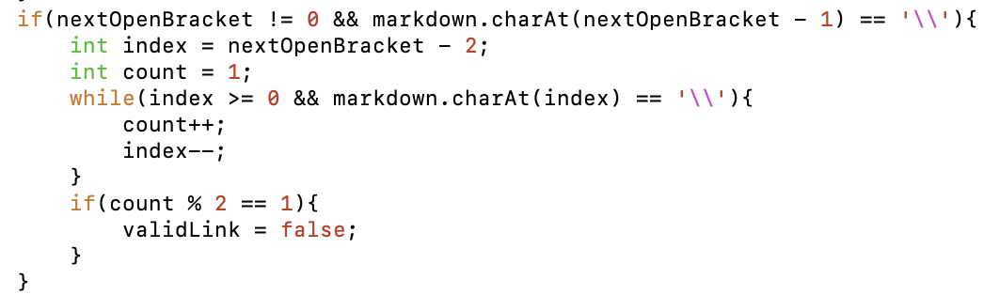
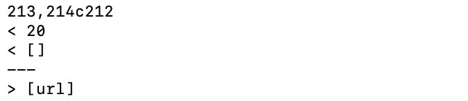
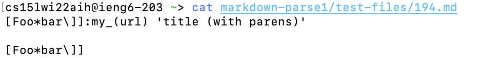
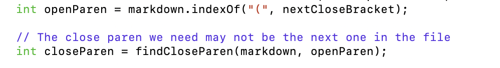

# Report 5 of Chenrong Gu
> ##  Difference 1

> How I find this?

I used *`diff`* command to compare the results.txt files of running a bash for loop.

> Some description

This is the test file which causes the difference:

Considering the content in this text file, the predicted output should be *`[]`*. So, I think my implementation is correct (ignore the number used to show some index information).

The problem in the provided implementation:

I think the problem is this program does not have the ability to recognize the \ symbol before the next open bracket, which means this link is not valid. 

In my own implementation, this part of code functions to check the \ symbol:

> ## Difference 2

> How I find this?

Similar to the previous one, I used *`diff`* command to compare the results.txt files of running a bash for loop.

> Some Description

This is the text file which causes the difference:

Considering the content in this text file, using the preview function of Vscode, the predicted output should be *`my_(url)`*. So, I think both the implementations are not correct.

The problem in the provided implementation:

I think the problem is this program was designed to recognize links between parentheses, but links can be positioned after brackets followed by a colon.